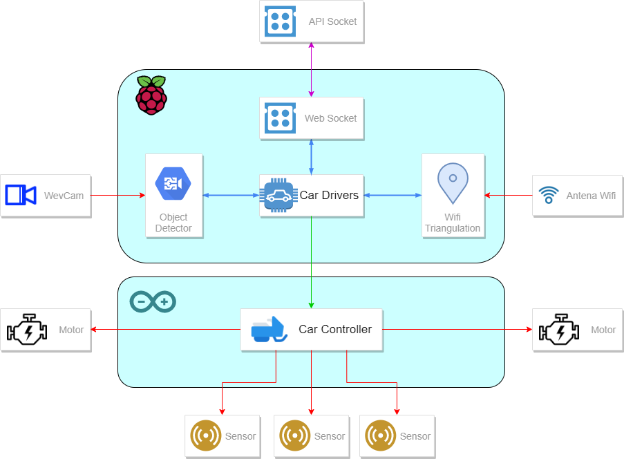

# Self drive car

## Features:

- Line tracking
- Detection of objects and their proximity
- QR code reading
- Wifi triangulation for their location 
- Communication with an API

## Structure

## Real-time detection of objects and QR codes

Capture images from the webcam to process them through our model to detect objects and QR codes, in order to be able to detect people and objects that are in the center of the image and obtain information from the QR codes read

### Operation
The file `qr_object_detection.py`, is responsible for performing object recognition along with the QR codes from the webcam of the device.

Once the program is executed, in this sample version, a window will be displayed with the frames captured by the webcam with the objects detected by the AI, delimited with a rectangle of different colors depending on the proximity:
- Blue: The car will follow the line normally.
- Yellow: A signal will be sent to the car driver to decrease the speed.
- Red: The car will stop until new signal

On the other hand, it will also be in charge of searching for QR codes in order to identify the stops and thus reinforce the positioning.
Once you receive a notification to go to a specific stop, the car will use the location to get to the stop, but to stay exactly in place will look for the QR code of the stop and once the find will send the notification to the customer informing that it has already arrived

To see some samples of the operation and its evolution, you can watch the following videos: 
 - [Customer Recognition Test](/Test_Driver/carvision/examples/Deteccion-de-clientes.mp4)
 - [Customer and QR Recognition Test](/Test_Driver/carvision/examples/Deteccion-de-clientes-y-QR2.avi)

## Wifi triangulation

analyzes nearby networks and calculates their position based on the strength of the received signal and a dictionary with the position of known Wi-Fi networks 'wifi_dictionary.csv'

### Visualization

